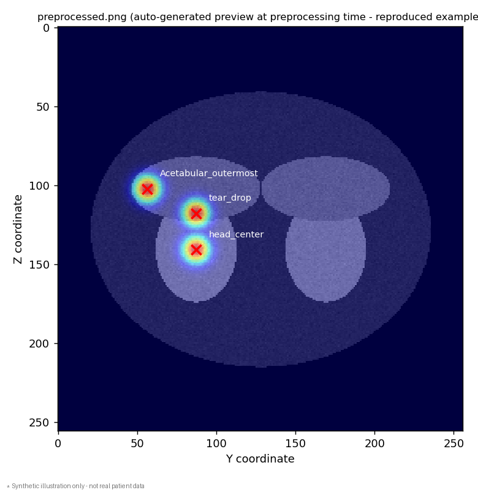
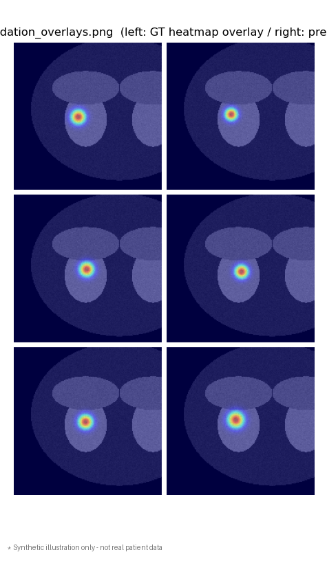
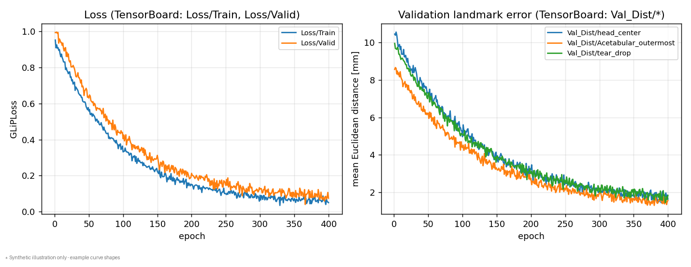

# Landmarker

3D 医用画像(股関節 MRI)から解剖学的ランドマークを自動検出する、SwinUNETR ベースのヒートマップ回帰パイプラインです。前処理・学習(K-fold)・評価までを一貫して実行できます。

> **Note**: このリポジトリには患者データや実行結果画像は含まれていません。本 README に掲載している画像はすべて **合成データによるイメージ図** であり、実際のモデル精度を示すものではありません。

## 概要

Landmarker は、3D 画像上の任意の解剖学的ランドマーク(特徴点)の座標を、Gaussian ヒートマップ回帰によって推定するための研究用パイプラインです。

- 入力: 前処理済み 3D MRI(`.mhd`)+ 3D Slicer の Markups Fiducial(`.fcsv`)形式のランドマーク座標
- モデル: [MONAI](https://monai.io/) の `SwinUNETR`(Swin Transformer ベースの 3D UNet)
- 出力: ランドマークごとに 1 チャンネルの 3D ヒートマップ → Soft-Argmax でサブピクセル精度の座標に変換
- 評価: 予測座標と正解座標の物理空間(mm)上でのユークリッド距離誤差

デフォルト設定では、股関節(骨盤)MRI における `head_center`(大腿骨頭中心)、`Acetabular_outermost`(臼蓋外側縁)、`tear_drop`(ティアドロップ)の 3 点を検出する構成になっていますが、`--lm_keys` を変更することで任意のランドマークセットに対応できます。

## 処理パイプライン

```
raw MRI (.mhd) + landmark (.fcsv)
        │
        ▼
 ① 前処理 (bin/preprocess.py)
    - 5–95 percentile windowing による正規化
    - 物理座標 → ボクセル座標への変換
    - ランドマークごとの 3D Gaussian ヒートマップ生成
    - K-fold 分割 (train / valid / test)
        │
        ▼
 ② 学習 (bin/train.py)
    - SwinUNETR (feature_size=48) によるヒートマップ回帰
    - GLiPLoss (Wasserstein 距離 + 勾配ペナルティ) で最適化
    - K-fold で学習 → TensorBoard に loss / 距離誤差を記録
    - 一定epochごとに checkpoint と検証可視化画像を保存
        │
        ▼
 ③ 評価・後処理 (postprocesser / eval)
    - SoftArgMax で予測ヒートマップから座標を復元
    - アフィン変換で物理座標(mm)に変換
    - 正解座標とのユークリッド距離を算出
```

## 出力イメージ(サンプル)

以下は `src/swinunetr/utils/visualizer.py` が実際に生成する画像フォーマットを、合成データで再現したイメージ例です。実データを用いた際の出力もこれと同じレイアウトで保存されます。

### 1. 前処理時のプレビュー(`preprocessed.png`)

各症例の前処理時に、正規化後の画像スライス・合成ヒートマップ・ランドマーク位置を重ねたプレビュー画像が自動生成されます。



### 2. 学習中の検証可視化(`epoch_{N}_validation_overlays.png`)

学習中は一定 epoch ごとに、検証データに対する「正解ヒートマップ(左)」と「モデルの予測ヒートマップ(右)」を画像に重ねたものを並べて保存し、学習の進み具合を目視で確認できます。



### 3. TensorBoard による学習曲線

`Loss/Train`・`Loss/Valid` に加えて、ランドマークごとの検証誤差(mm)が `Val_Dist/{landmark_name}` として TensorBoard に記録されます。



```bash
tensorboard --logdir ./workspace/<project_name>_<k>fold/summary
```

## ディレクトリ構成

```
Landmarker/
├── bin/
│   ├── preprocess.py         # 前処理エントリポイント
│   └── train.py               # 学習エントリポイント
├── src/swinunetr/
│   ├── preproceser/           # 前処理 (windowing, heatmap生成, k-fold分割)
│   ├── dataloading/           # データリスト構築 / MONAI CacheDataset
│   ├── data_augmentation/     # 学習/検証用の transform 定義
│   ├── loss/                  # GLiPLoss (Wasserstein + gradient penalty)
│   ├── trainer/                # 学習・検証ループ (K-fold)
│   ├── postprocesser/         # SoftArgMax によるヒートマップ→座標変換
│   ├── eval/                  # 座標変換・距離評価ユーティリティ
│   └── utils/                 # fcsv 読み書き, affine, ロガー, 可視化
├── prepare_dataset_arc.ipynb  # データセット準備用ノートブック
├── preprocess.sh / train.sh   # 実行用シェルスクリプト
├── pyproject.toml             # Poetry による依存関係定義
└── workspace/                  # 学習出力 (log, checkpoint, summary, visualize)
```

## セットアップ

Python 3.12〜3.14 系、パッケージ管理には [Poetry](https://python-poetry.org/) を使用しています。

```bash
git clone https://github.com/yuruihito/Landmarker.git
cd Landmarker
poetry install
```

主な依存ライブラリ: `torch`, `monai`, `simpleitk`, `itk`, `nibabel`, `tensorboard`, `numpy`, `pandas`, `scikit-learn`, `matplotlib`

GPU (CUDA) が利用可能な環境での学習を推奨します(`SoftArgMax` は CPU でも動作しますが低速になります)。

## データセットの準備

`--dataset_dir` に指定するディレクトリは、以下の構造を想定しています(`bin/preprocess.py` のコメントより)。

```
dataset/
└── <project_name>/
    ├── input/
    │   ├── id001/raw_mri_cropped.mhd
    │   └── id002/raw_mri_cropped.mhd
    ├── fcsv/
    │   ├── id001/landmark.fcsv   # 3D Slicer Markups Fiducial 形式
    │   └── id002/landmark.fcsv
    ├── preprocessed/             # ← 前処理スクリプトの出力
    │   ├── id001/
    │   │   ├── raw.mhd
    │   │   ├── label.mhd
    │   │   └── preprocessed.png
    │   └── id002/...
    └── kfold/                    # ← 前処理スクリプトの出力
        ├── fold1/{train,valid,test}.txt
        └── fold2/...
```

`landmark.fcsv` には検出したいランドマークの名前と物理座標(x, y, z [mm])が含まれている必要があります。ランドマーク名は `--lm_keys` で指定した文字列と一致させてください。

## 使い方

### 1. 前処理

```bash
poetry run python -m bin.preprocess \
  --dataset_dir /path/to/dataset \
  --project_name practice_40cases \
  --k_fold 4 \
  --lm_keys head_center Acetabular_outermost tear_drop \
  --sigma 3.0
```

または `preprocess.sh` を環境に合わせて編集し実行してください。

| 引数 | 説明 | デフォルト |
|---|---|---|
| `--dataset_dir` | データセットのルートディレクトリ | - |
| `--project_name` | プロジェクト名(出力ディレクトリ名に使用) | `project` |
| `--k_fold` | 分割する fold 数 | `4` |
| `--lm_keys` | 検出対象のランドマーク名(複数指定可) | `head_center Acetabular_outermost tear_drop` |
| `--sigma` | 生成する Gaussian ヒートマップの標準偏差 | `3.0` |

### 2. 学習

```bash
poetry run python -m bin.train \
  --dataset_dir /path/to/dataset \
  --project_name practice_40cases \
  --output_dir ./workspace \
  --patch_size 96 \
  --batch_size 2 \
  --k_fold 4 \
  --lr 1e-4 \
  --max_epoch 400 \
  --lm_keys head_center Acetabular_outermost tear_drop
```

または `train.sh` を実行してください。学習結果は `./workspace/<project_name>_<k_fold>fold/` 以下に、fold ごとの

- `log/` : 学習ログ
- `checkpoint/` : モデルの重み(`--model_each_save_epoch` ごとに保存)
- `summary/foldN/` : TensorBoard イベントファイル
- `visualize/foldN/` : 検証可視化画像(上記サンプル参照)

として保存されます。

| 引数 | 説明 | デフォルト |
|---|---|---|
| `--dataset_dir` | 前処理済みデータセットのルートディレクトリ | - |
| `--output_dir` | 出力先ディレクトリ | `./workspace` |
| `--patch_size` | 学習時の 3D パッチサイズ(立方体の一辺) | `96` |
| `--batch_size` | バッチサイズ | `2` |
| `--k_fold` | K-fold の分割数 | `4` |
| `--lr` | 学習率 | `1e-4` |
| `--max_epoch` | 最大エポック数 | `400` |
| `--model_each_save_epoch` | モデル・可視化画像を保存する epoch 間隔 | `20` |

## モデル・アルゴリズムの詳細

- **モデル**: `monai.networks.nets.SwinUNETR`(`in_channels=1`, `out_channels=len(lm_keys)`, `feature_size=48`, `use_checkpoint=True`)。1 ランドマークにつき 1 出力チャンネルのヒートマップを予測します。
- **損失関数 (`GLiPLoss`)**: ヒートマップ間の Wasserstein 距離に、隣接ボクセル間の勾配差に基づくペナルティ項を加えたカスタム損失です。
- **座標復元 (`SoftArgMax`)**: 予測ヒートマップを上位パーセンタイル(デフォルト 95%)で閾値処理した後 softmax し、期待値(重心)として (z, y, x) 座標を算出します。
- **評価指標**: 予測座標をアフィン変換で物理座標(mm)に変換し、正解座標との平均ユークリッド距離をランドマークごと・全体で算出します。

## 今後の予定 / 既知の制限

- `src/swinunetr/eval/calculate_lm_dis.py` は現時点で未実装です。
- ライセンスは未設定です。公開・再利用の条件については作者にお問い合わせください。

## 作者

Yuito Kameda ([@yuruihito](https://github.com/yuruihito))
